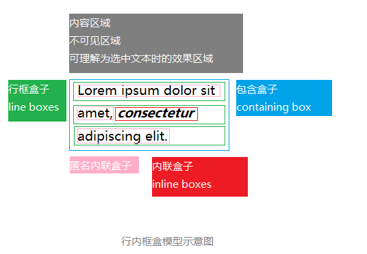
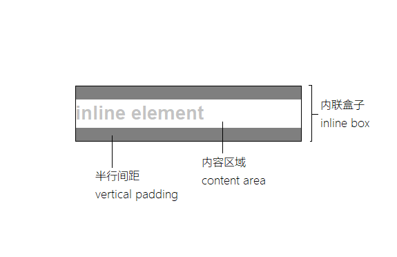

# CSS深入理解之line-height

## line-height的定义

- 行高：两行文字基线之间的距离

- 为何是基线：基线是定义所有字线的根本

- 不同字体和基线的距离不同，在字格中放置的样式不同

## 行内框盒模型

- 内容区域（content area）
- 内联盒子|行内框（inline boxes）
- 行框盒子|行宽（line boxes）
- 包含盒子（containing box）

行高决定内联盒子高度

内容区域高度只与字号和字体有关，和行高无关

行间距（vertical padding）= 行高 - 内容区域

行框高度是最高行内框到最低行内框的距离

## line-height属性值

- `normal`: 和浏览器以及元素字体相关
- 数值：1.5，根据当前元素的`font-size`计算
- 具体长度：1.5em, px, rem
- 百分比：150%
- inherit：`input`的默认行高为`normal`

### 1.5, 1.5em, 150%的差别

- 1.5 - 继承`line-height`，元素根据自身的`font-size`计算
- 1.5em, 150% - 设置`line-height`的元素计算好具体值再继承该值

## line-height与图片

隐匿文本节点产生一个不可见的行内框，图片默认对齐基线，导致图片并非贴紧容器底边

`line-height`和`height`设置一致，并非是完全垂直，除非`font-size`为0

  See the Pen <a href="https://codepen.io/curlywater/pen/XoWPEg">
  inline element</a> by Curly.Water (<a href="https://codepen.io/curlywater">@curlywater</a>)
  on <a href="https://codepen.io">CodePen</a>.

