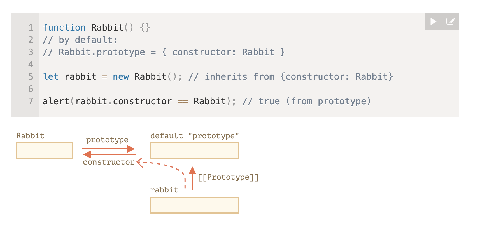
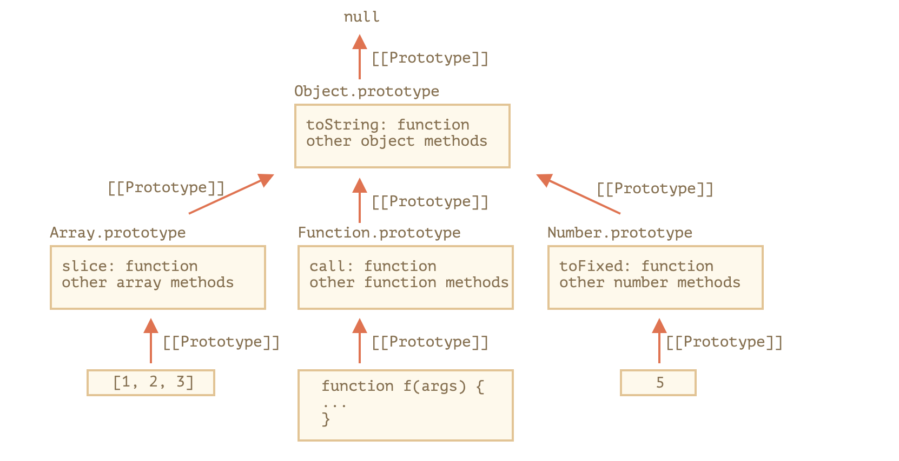

[《JavaScript.info》](https://javascript.info/) JavaScript 编程语言部分的学习笔记。
# 基础知识

## 脚本引入

内嵌脚本

```html
<html>
	<head></head>
	<body>
		<script>
	    alert('Hello, world!');
	  </script>
	</body>
</html>
```

在HTML5中，`type`和`language`已无需指定

外部脚本

```html
<script src="<https://cdnjs.cloudflare.com/ajax/libs/lodash.js/3.2.0/lodash.js>"></script>
```

使用独立文件的好处是浏览器会下载它，然后将它保存到浏览器的缓存中。这可以节省流量，并使得页面（加载）更快。

**总结：临时的简单逻辑片段可以使用内嵌脚本，复杂逻辑使用外部脚本独立管理。**


## 自动分号插入

JavaScript具有自动插入分号的能力，开发者可以选择不写分号，在多数情况下代码可以正确运行。

然而，存在JavaScript无法确认是否需要自动插入分号的情况，这种情况下将导致难以排查的代码错误。

```jsx
alert("There will be an error")

[1, 2].forEach(alert)
```

JavaScript 并不会在方括号 [...] 前添加一个隐式的分号。因此代码将被解析为👇这样

```jsx
alert("There will be an error")[1, 2].forEach(alert)
```

**总结：主动书写分号，避免引擎无法确认是否需要自动插入分号的情况。**


## 严格模式

```jsx
"use strict";
```

向引擎指明JavaScript代码需要在严格的条件下运行。严格模式做了什么？

- 消除代码运行的一些不安全之处，保证代码运行的安全；比如，不允许使用未声明变量，这在默认的松散模式下是被允许的。了解更多限制可以看[这篇文章](https://zhuanlan.zhihu.com/p/122193624)
- 提高编译器效率，增加运行速度；
- 为未来新版本的JavaScript做好铺垫。比如，新增关键字：`let/static/public`......

浏览器兼容性：Internet Explorer 10 +、 Firefox 4+ Chrome 13+、 Safari 5.1+、 Opera 12+。

**总结：对于现代开发，建议使用严格模式启动脚本。**


## 变量和常量

- 使用`let`声明变量，一行声明一个变量可读性相对更好。
- 使用`const`声明常量，硬编码常量使用大写命名，需在运行时计算的常量使用小写。
- 变量命名仅包含字母，数字，$和_，字母包括任何语言字符（比如中文，阿拉伯文），但不推荐使用。
- 变量命名不允许使用数字开头。

```jsx
let color;
let length = 10;

color = "red";
length = 20;
const SIZE_SMALL = 12;
const SIZE_MIDDLE = 14;
const SIZE_LARGE = 16;

const size = getSize();
```


## 数据类型

### 八大基础数据类型

#### number

- 整数、浮点数、特殊值（Infinity, -Infinity, NaN）

- 安全范围

  ```javascript
  const biggestInt  = Number.MAX_SAFE_INTEGER  //  (2^53 - 1) =>  9007199254740991
  const smallestInt = Number.MIN_SAFE_INTEGER  // -(2^53 - 1) => -9007199254740991
  ```

  超出安全范围的数据无法正确算术运算，无法通过JSON parser正确转换为对应数值。

#### bigInt

- 任意长度的整数

#### string

- 字符串

#### boolean

- true/false

#### null

- 空值或未知值，不代表空的object

#### undefined

- 未定义值，一般是变量已声明但未定义的情况

#### symbol

- 唯一标识

#### object

- 其他几个数据类型称为“原始类型”，因为值只包含一个单独的内容。`object`则用于存储复杂的数据结构。

### 查询基本数据类型

```javascript
var str = "abc"
typeof str; // "string"
typeof(str); // "string"
```

- `typeof x` 或者 `typeof(x)`
- 以字符串形式返回类型名称，比如"string"
- `typeof null` 会返回 `"object"` —— 这是 JavaScript 编程语言的一个错误，实际上它并不是一个 object。


## 数据类型转换

#### 字符串转换

- 发生在输出内容时
- 显式转换：`String(value)`

#### 数字型转换

- 发生在算术操作时

- 显式转换：`Number(value)`

  忽略字符串的首尾处的空格字符。从左到右读取，遇到无法转换为数字的字符输出NaN。空字符串转换为0。
  
  ```javascript
  Number(undefined); // NaN
  Number(null); // 0
  Number(true); // 1
  Number(false); // 0
  Number(" 123 "); // 123
  Number("4px"); // NaN
  Number(""); // 0
  ```

#### 布尔型转换

- 发生在逻辑操作时
- 显式转换：`Boolean(value)`
  - 0, 0n, `null`,` undefined`,` NaN`,` ""` -> `false`
  - 其他 -> `true`


## 运算符

- 进行算术操作时，会对运算元进行**数字类型**转换
- 二元 运算符 "+" 具有字符串类型转换和连接字符串的特性：如果其中一个运算元是字符串，运算元将被转换为字符串连接。例如：`"4" + 2 // "42"`
- 一元运算符 "+" "-" 具有数字类型转换特性，例如 `+"4" // 4`，`-"4" // -4`
- 自增/自减运算符：自增自减只能应用于变量。前置先做自增自减再做其他操作，后置先做其他操作再自增自减


## 值的比较

- 值的比较返回布尔值

- 同类型数据比较

  - 字符串比较逐个比较字符的Unicode编码值，例如`"apple" < "pineapple"`
  - 其他类型转换为数字类型再比较

- 不同类型数据比较

  - 转换为**数字类型**再进行比较，例如`"1" > false`

  - **特殊的情况：**在做相等比较时，`null`和`undefined`不会进行类型转换，因此

    ```javascript
    null == undefined // true
    null == 0 // false
    ```

  - **再一个特殊的情况：** 严格相等比较时，不会进行类型转换，因此

    ```javascript
    null === undefined // false
    ```


## 逻辑运算符

- `||` 串联：寻找第一个真值，返回初始值，**并不是**返回转换后的布尔值
- `&&` 串联：寻找第一个假值，返回初始值，**并不是**返回转换后的布尔值
- 运算符优先级：`! > && > ||`


## 空值合并操作符

- `x = a ?? b`，a不为`null`且不为`undefined`时返回b

  相当于`x = (a !== null && a !== undefined) ? a : b;`

- 和`||`的区别：
  - `||`返回第一个真值
  - `??`返回第一个已定义值

- 优先级极低，表达式中有其他逻辑时最好使用`()`包裹

- 不能和AND或OR共用

  ```javascript
  null || undefined ?? "foo"; // 抛出 SyntaxError
  // 使用括号来显式表明运算优先级，是没有问题的：
  (null || undefined ) ?? "foo"; // 返回 "foo"
  ```


## 可选链式操作符

``` javascript
let user = {}; // user has no address

alert( user?.address?.street ); // undefined (no error)
```

如果对象链上的引用是`nullish(null或者undefined)`，`?.`会按照短路的方式处理，返回`undefined`

``` javascript
obj?.prop
obj?.[expr]
arr?.[index]
func?.(args)
```

不能用于赋值

``` javascript
let object = {};
object?.property = 1; // Uncaught SyntaxError: Invalid left-hand side in assignment
```


## 函数

- **函数表达式**在代码执行到达时被创建，并且仅从那一刻起可用。
- **在函数声明被定义之前，它就可以被调用。** 这是内部算法的原故。当 JavaScript **准备** 运行脚本时，首先会在脚本中寻找全局函数声明，并创建这些函数。我们可以将其视为“初始化阶段”。
- 严格模式下，当一个函数声明在一个代码块内时，它在该代码块内的任何位置都是可见的。但在代码块外不可见。


# Object（对象）：基础知识

## 对象基础知识

- 通常通过创建对象来表示真实世界中的实体，实体具有特性（对象属性）和行为（对象方法）。
- 对象属性名（`key`）必须是字符串或 `Symbol`。其它类型将被自动地转化为字符串。
- 对象字面量中属性名可用方括号包裹的表达式表示，称之为计算属性。
- 使用 `delete` 删除属性，使用 `in` 检查属性是否存在，使用 `for..in` 遍历对象中的所有键。
- 对象排序：整数键按升序排序，其他键按创建顺序排序。
- 对象和原始类型的区别是，对象通过引用存储和复制，即变量存储的是内存中的地址而非对象本身。
- 被 `const` 修饰的对象是可以被修改。 `const user = { name: "John" }; user.age = 25;` 关键字 const 只保护变量本身不被改变，变量存储的是对一个对象的引用，对象的内容改变并不会改变对象的内存地址。
- 对象的复制，使用 `Object.assign` 进行浅拷贝，`_.cloneDeep(obj)` 进行深拷贝。

## 垃圾回收

JavaScript 中主要的内存管理概念是 **可达性**。

简而言之，“可达”值是那些以某种方式可访问或可用的值。它们一定是存储在内存中的。

1. 这里列出固有的可达值的基本集合，这些值明显不能被释放。

   比方说：

   - 当前函数的局部变量和参数。
   - 嵌套调用时，当前调用链上所有函数的变量与参数。
   - 全局变量。
   - （还有一些内部的）

   这些值被称作 **根（roots）**。

2. 如果一个值可以通过引用或引用链从根访问任何其他值，则认为该值是可达的。

3. 如果局部变量中有一个对象，并且该对象有一个属性引用了另一个对象，则该对象被认为是可达的。而且它引用的内容也是可达的。。

在 JavaScript 引擎中有一个被称作垃圾回收器的东西在后台执行。它监控着所有对象的状态，并删除掉那些已经不可达的。

JavaScript 引擎做了许多优化，使垃圾回收运行速度更快，并且不影响正常代码运行。

一些优化建议：

- **分代收集（Generational collection）**—— 对象被分成两组：“新的”和“旧的”。许多对象出现，完成他们的工作并很快死去，他们可以很快被清理。那些长期存活的对象会变得“老旧”，而且被检查的频次也会减少。
- **增量收集（Incremental collection）**—— 如果有许多对象，并且我们试图一次遍历并标记整个对象集，则可能需要一些时间，并在执行过程中带来明显的延迟。所以引擎试图将垃圾收集工作分成几部分来做。然后将这几部分会逐一进行处理。这需要他们之间有额外的标记来追踪变化，但是这样会有许多微小的延迟而不是一个大的延迟。（类似于分片+追踪变化）
- **闲时收集（Idle-time collection）**—— 垃圾收集器只会在 CPU 空闲时尝试运行，以减少可能对代码执行的影响。

## Symbol

- 通过 `Symbol(name)` 创建唯一的标识符，name是可选的描述。
- `Symbol` 不会自动转换为字符串，因此直接输出会抛出类型错误。如果真的想要显示一个 `Symbol`，可以使用 `toString()` 方法。或者通过 `symbol.description` 获取描述。
- 在对象中， `Symbol` 是“隐藏符号属性”
  - 代码的任何其他部分都不能意外访问或重写这些属性
  - 隐藏符号属性不参与 `for..in` 循环
  - 在对象复制时，隐藏符号属性会被复制
- 通过全局注册表获取和创建全局 `Symbol`
  - `Symbol.for(key)` 返回（如果需要的话则创建）一个以 key 作为名字的全局标识符
  - `Symbol.keyFor(symbol)` 返回全局标识符对应的描述
- 从技术上说，`Symbol` 不是 100% 隐藏的。有一个内置方法 `Object.getOwnPropertySymbols(obj)` 允许我们获取所有的 `Symbol`。还有一个名为 `Reflect.ownKeys(obj)` 的方法可以返回一个对象的 所有 键，包括 `Symbol`。所以它们并不是真正的隐藏。但是大多数库、内置方法和语法结构都没有使用这些方法。

## this

- `this` 的引用是在代码运行时计算出来的，它取决于代码上下文。
  - 以对象方法的语法调用函数时：`object.method()` ，`this` 的值是 `object`
  - 在全局作用域，`this` 的值是 `Window`
  - 在普通函数中，严格模式下，`this` 的值是 `undefined` ；非严格模式下， `this` 的值是 `Window`
  - 作为构造函数调用函数时，`this` 指向实例化的对象
  - 使用`call`/ `apply`调用时，`this` 指向参数指定上下文
- 箭头函数本身没有`this`，导致以下三种现象：
  - 根据外层（函数或者全局）作用域来决定 `this`
  - 箭头函数不能作为构造函数使用
  - 不能使用`call`, `apply`手动修改`this`
- 方法调用的内部原理：引用类型。
  - 当以对象方法调用函数时：`object.method()`，点符号返回一个引用类型值 —— `(base, name, strict)`，`base`是对象，`name`是属性名，`strict`是`boolean`值严格模式下为`true`。
  - 引用类型是一种特殊的“中间”内部类型，用于将信息从点符号 . 传递到调用括号 ()。
  - 像赋值 `hi = user.hi` 等其他的操作，将引用类型作为一个整体丢弃，只获取 `user.hi`（一个函数）的值进行传递。因此，任何进一步的操作都会“失去” `this`。

## 对象原始值转换

对象到原始值的转换，是由许多期望以原始值作为值的内建函数和运算符自动调用的。

这里有三种类型（hint）：

- `"string"`（对于 `alert` 和其他需要字符串的操作）
- `"number"`（多数算术运算，大小比较）
- `"default"`（二元加分，相等比较）

规范明确描述了哪个运算符使用哪个 hint。很少有运算符“不知道期望什么”并使用 `"default"` hint。通常对于内建对象，`"default"` hint 的处理方式与 `"number"` 相同，因此在实践中，最后两个 hint 常常合并在一起。

转换算法是：

1. 调用 `obj[Symbol.toPrimitive](hint)` ，
2. 否则，如果 hint 是 `"string"`。尝试 `obj.toString()` 和 `obj.valueOf()`，无论哪个存在。
3. 否则，如果 hint 是 `"number"` 或者 `"default"`。尝试 `obj.valueOf()` 和 `obj.toString()`，无论哪个存在。

在实践中，为了便于进行日志记录或调试，对于所有能够返回一种“可读性好”的对象的表达形式的转换，只实现以 `obj.toString()` 作为全能转换的方法就够了。

## 构造函数

- 构造函数，又称构造器。本质是常规函数，和常规函数的区别在于

  - 构造函数约定首字母大写
  - 只能通过 `new` 来调用

- 使用 `new` 调用构造函数时，实质上是创建了空的 `this`，并在最后返回填充了值的 `this`。类似于下面的代码

  ```jsx
  function User(name) {
    // this = {};（隐式创建）
  
    // 添加属性到 this
    this.name = name;
    this.isAdmin = false;
  
    // return this;（隐式返回）
  }
  ```

- 在函数中使用 `new.target` 可知其是否被 `new` 调用。在一些库中会使用该特性使构造语法更加灵活

  ```jsx
  function User(name) {
    if (!new.target) { // 如果你没有通过 new 运行我
      return new User(name); // ……我会给你添加 new
    }
  
    this.name = name;
  }
  
  let john = User("John"); // 将调用重定向到新用户
  alert(john.name); // John
  ```

- 构造函数中， `return` 对象时返回该对象，在所有其他情况下返回 `this`

- 构造函数用于复用对象创建逻辑，以及聚合复杂对象创建逻辑


# 数据类型

## 原始类型

现实情况，存在两个需求：

- 原始类型本身只包含一个原始值，非常轻量。
- 原始类型可以执行操作，但是需要保持轻量。

解决方案，使用“对象包装器”：

1. 在访问原始类型的属性或方法时，JavaScript内部创建一个对象包装器，承载原始值和对象上的方法。
2. 对象访问属性或者执行操作
3. 销毁对象包装器，留下原始值

JavaScript 引擎高度优化了这个过程。它甚至可能跳过创建额外的对象。但是它仍然必须遵守规范，并且表现得好像它创造了一样。

思考下面的代码：

```jsx
let str = "Hello";

str.test = 5;

alert(str.test);
```

你怎么想的呢，它会工作吗？会得到什么样的结果？

- Answer
  1. `undefined`（非严格模式）
  2. 报错（严格模式）。


## 数字类型

### 科学计数法

可以用科学技术法来省略0，如 `123e6`，`1e-10`


### Number 转换为 String

`String(number)` 将数字转换为字符串，但无法指定进制。


`number.toString(base)`  将数字转换为基于 `base` 进制的字符串，如 `255..toString(16) //ff`  

P.S.这里的..是为了解决小数点和方法调用语法冲突，也可以使用 `(255).toString(16)`。


### String 转换为 Number

`Number(string)` 逐个读取字符，遇到无法转换为数字的字符返回 `NaN`


`parseInt(str, base) / parseFloat(str)` ，它从字符串中读取一个数字，然后返回错误发生前可以读取的值。如 `parseInt("123e", 10) // 123`  `parseFloat("123.1.2") // 123.1`


### 小数精度损失

JavaScript中的数字以双精度浮点数存储，因此存在小数点精度损失的问题。

比如0.1，0.2这类无法使用二进制有限位数保存的数字，在使用时会有误差，`0.1 + 0.2 ≠ 0.3` `0.155.toFixed(2) == 0.15`

遇到这类问题，可以先将小数放大为整数或者其他无精度损失的数值，再进行计算。


### 小数舍入

| 方法               | 说明                  |
| ------------------ | --------------------- |
| Math.floor(number) | 向下取整              |
| Math.round(number) | 四舍五入为整数        |
| Math.ceil(number)  | 向上取整              |
| Math.trunc(number) | 直接截取整数          |
| number.toFixed(n)  | 四舍五入到小数点后n位 |


### 随机数

`Math.random()` - 返回[0, 1)区间内数字

获取指定范围内随机整数，并要求获取概率一致。

如果直接使用 `Math.round(Math.random() * (max - min)) + min` 获取，概率并不一致。

```
min...min+0.5...min+1...min+1.5   ...    max-0.5....max
└───┬───┘└────────┬───────┘└───── ... ─────┘└───┬──┘   ← Math.round()
   min          min+1                          max
```

解法一：选择在前后补上0.5

```jsx
function randomInteger(min, max) {
  // now rand is from  (min-0.5) to (max+0.5)
  let rand = min - 0.5 + Math.random() * (max - min + 1);
  return Math.round(rand);
}
```

解法二：在[min, max + 1)之间向下取整

```jsx
function getRandomIntInclusive(min, max) {
  min = Math.ceil(min);
  max = Math.floor(max);
  return Math.floor(Math.random() * (max - min + 1)) + min; //The maximum is inclusive and the minimum is inclusive 
}

function getRandomInt(min, max) {
  min = Math.ceil(min);
  max = Math.floor(max);
  return Math.floor(Math.random() * (max - min)) + min; //The maximum is exclusive and the minimum is inclusive
}
```


## 字符串

### 字面量

有 3 种类型的引号。反引号允许字符串跨越多行并可以使用 `${…}` 在字符串中嵌入表达式。


### 字符串存储

JavaScript 中的字符串使用的是 UTF-16 编码。UTF-16是字符编码表的一种实现方式，把Unicode字符集的抽象码位映射为16位长的整数（即码元）的序列，用于数据存储或传递。


所有常用的字符都是一个 2 字节的代码，但 2 字节只允许 65536 个组合，这对于表示每个可能的符号是不够的。所以稀有的符号被称为“代理对”的一对 2 字节的符号编码。这些符号的长度是 2。

```
alert( '𝒳'.length ); // 2，大写数学符号 X
alert( '😂'.length ); // 2，笑哭表情
alert( '𩷶'.length ); // 2，罕见的中国象形文字
```

`charCodeAt` 总是返回一个小于 65536 的值。这是因为高位编码单元使用一对低位编码代理伪字符来表示，从而构成一个真正的字符。因此，为了查看或复制65536 及以上编码字符的完整字符，需要在获取 `charCodeAt(i)` 的值的同时获取 `charCodeAt(i+1)` 的值，或者改为获取 `codePointAt(i)` 的值。

Source: https://developer.mozilla.org/zh-CN/docs/Web/JavaScript/Reference/Global_Objects/String/charCodeAt

`chartCodeAt/fromCharCode` 是基于 UTF-16 的获取和编码，`codePointAt/fromCodePoint` 是基于UTF-32的获取和编码。

```jsx
"𠮷".charCodeAt(0).toString(16);//d842
"𠮷".charCodeAt(1).toString(16);//dfb7

"𠮷".codePointAt(0);//20bb7
"𠮷".codePointAt(1);//dfb7

console.log("\\ud842\\udfb7");//𠮷, an example of hexadecimal digits
console.log("\\u20bb7\\udfb7");//₻7�
console.log("\\u{20bb7}");//𠮷 an unicode code point escapes the "\\ud842\\udfb7"
```

Source: https://stackoverflow.com/questions/36527642/difference-between-codepointat-and-charcodeat


### 字符串操作

#### 获取字符

- 使用 `[]`，查找不到字符时返回undefined
-  `str.charAt(pos)` ，查找不到字符时返回空字符串


#### 获取子字符串

| 方法                  | 范围                              | 说明                      |
| --------------------- | --------------------------------- | ------------------------- |
| slice(start, end)     | [start, end)                      | 支持负数，负数从尾部倒数  |
| substring(start, end) | [min(start, end), max(start,end)) | 负数相当于0               |
| substr(start, length) | [start, start+length)             | 从start开始取length个字符 |


### 查找字符串

- `indexOf(str, pos)`
- `includes(str, pos)`
- `startsWith(str)`
- `endsWith(str)`
- `includes(str) === ~indexOf(str)`


### 大/小写转换

字符串的大/小写转换，使用：`toLowerCase/toUpperCase`。


### 字符串比较

如果直接使用值比较，将根据字符在字符编码表中对应的编号比较。除此之外，可以通过 `str.localeCompare(str1)` 根据语言规则比较。

调用 [str.localeCompare(str2)](https://developer.mozilla.org/zh/docs/Web/JavaScript/Reference/Global_Objects/String/localeCompare) 会根据语言规则返回一个整数，这个整数能表明 `str` 是否在 `str2` 前，后或者等于它：

- 如果 `str` 小于 `str2` 则返回负数。
- 如果 `str` 大于 `str2` 则返回正数。
- 如果它们相等则返回 `0`。


## 数组

数组用于存储有序集合，JavaScript 引擎尝试把这些元素存储在连续的内存区域，并针对数组有所优化。数组的本质是对象，但如果按使用对象的方式使用数组，破坏其连续的特性，引擎对数组的优化将不再适用。

- 存储有序数据集合
- 连续内存区域
- 引擎对数组有所优化
- 本质是对象


### 类数组对象

- 索引
- length属性


### 双端队列数据结构

队列：`push/shift`和

栈：`push/pop`

`push/pop`的效率要高于`shift/unshift`，因为末端操作不需要更改其他元素的索引。

| 操作              | 返回值       | 说明                 |
| ----------------- | ------------ | -------------------- |
| push(...items)    | arr.length   | 向数组末端添加元素   |
| pop()             | 最后一个元素 | 从末端移除并返回元素 |
| unshift(...items) | arr.length   | 向数组首端添加元素   |
| shift()           | 第一个元素   | 从首端移除并返回元素 |


### length

- `length` 是一个自动计算值，其值为数组最大索引+1。
- 有趣的是，`length` 同时是一个可写值， `length` 被手动缩短时，数组将被截断。


### 数组遍历

- `for (let i = 0; i < arr.length; i++)` 运行的最快，可兼容旧版本浏览器。
- `for (let item of arr)` 现代语法，只能访问value无法访问索引
- `for (let i in arr)` 请不要使用该方法遍历数组。
  - `for..in` 是针对对象的遍历方法，会遍历所有属性，处理类数组对象时，“额外”属性被遍历将会导致问题。
  - `for..in` 循环适用于普通对象，并且做了对应的优化。但是不适用于数组，因此速度要慢 10-100 倍。
- `forEach` 数组方法， 但是无法中断循环


### 数组方法

#### 方法集合

| 操作                                                         | 返回值                   | 说明                                                         |
| ------------------------------------------------------------ | ------------------------ | ------------------------------------------------------------ |
| push(...items)                                               | arr.length               | 增                                                           |
| pop()                                                        | 最后一个元素             | 删                                                           |
| unshift(...items)                                            | arr.length               | 增                                                           |
| shift()                                                      | 第一个元素               | 删                                                           |
| splice(index[, deleteCount, elem1, ..., elemN])              | 被删除元素的数组         | 增删改，index为负数时从末尾倒数                              |
| slice(start, end)                                            | [start, ... , end-1]     | 获取数组副本，[start, end)                                   |
| concat(arg1, arg2...)                                        | 包含arg1, arg2元素的数组 | 拼接数组<br />只复制数组中的元素<br />其他对象如果具有Symbol.isConcatSpreadable属性，会被当作数组处理，否则会被视为一个整体 |
| arr.forEach(function(item, index, array){})                  | undefined                | 遍历数组                                                     |
| arr.indexOf(item, from)                                      | 索引                     | 查找元素所在第一个位置的索引，找不到为-1                     |
| arr.lastIndexOf(item, from)                                  | 索引                     | 从右向左查找元素所在第一个位置的索引                         |
| arr.includes(item, from)                                     | true/false               | 查找元素是否在数组中，能正确处理NaN                          |
| arr.find(function(item, index, array){})                     | 数组元素/undefined       | 查找数组中符合特定条件的第一个元素                           |
| arr.findIndex(function(item, index, array){})                | 元素索引/-1              | 查找数组中符合特定条件的第一个元素的索引                     |
| arr.filter(function(item, index, array) {});                 | [elem1, ...]/[]          | 查找数组中符合特定条件的所有元素                             |
| arr.map(function(item, index, array) {})                     | [elem1....]              | 对数组中每个元素都做处理                                     |
| arr.sort(function(a,b){})                                    | sorted arr               | 原位排序                                                     |
| arr.reverse()                                                | reversed arr             | 原位倒转                                                     |
| arr.join(glue)                                               | string                   | elements + glue -> string<br />和string.split(glue)互相转换  |
| arr.reduce(function(accumulator, item, index, array) {   // ... }, [initial]); | result                   | 带着结果遍历                                                 |
| arr.reduceRight(function(accumulator, item, index, array) {   // ... }, [initial]); | result                   | 带着结果从右向左遍历                                         |
| arr.some(fn)                                                 | true/false               | 检查数组中是否存在满足条件的元素                             |
| arr.every(fn)                                                | true/false               | 检查数组中每一个元素是否都满足条件                           |


#### sort

`sort()` 方法的语法为 `arr.sort([compareFunction])`

- 如果没有指明 `compareFunction`，那么元素会被按照转换为的字符串的诸个字符的 Unicode 编码进行排序
- 如果指明了 `compareFunction`，那么数组会按照调用该函数的返回值排序。

a 和 b 是两个将要被比较的元素：

- 如果 `compareFunction(a, b)` 小于 `0`，那么 `a` 会被排列到 `b` 之前；
- 如果 `compareFunction(a, b)` 等于 `0`，那么 `a` 和 `b` 的相对位置不变。
- 如果 `compareFunction(a, b)` 大于 `0`，那么 `b` 会被排列到 `a` 之前。


#### thisArg

几乎所有调用函数的数组方法 – 比如 `find`，`filter`，`map`，除了 `sort` 是一个特例，都接受一个可选的附加参数 `thisArg`。传递上下文给调用函数。


#### Array.isArray()

判断变量是否是数组

## 可迭代对象

### 可迭代对象

**可迭代（Iterable）** 对象是数组的泛化。这个概念是说任何对象都可以被定制为可在 `for..of` 循环中使用的对象。

- `for...of`启动时调用`Symbol.iterator`方法得到迭代器（**iterator**）—— 一个有`next`方法的的对象
- `for...of`循环迭代时调用`next()`
- `next()`返回`{done:.., value: ...}`对象

``` javascript
range[Symbol.iterator] = function() {

  // ……它返回迭代器对象（iterator object）：
  // 2. 接下来，for..of 仅与此迭代器一起工作，要求它提供下一个值
  return {
    current: this.from,
    last: this.to,

    // 3. next() 在 for..of 的每一轮循环迭代中被调用
    next() {
      // 4. 它将会返回 {done:.., value :...} 格式的对象
      if (this.current <= this.last) {
        return { done: false, value: this.current++ };
      } else {
        return { done: true };
      }
    }
  };
};
```

### 内置可迭代对象

数组和字符串

### Array.from

通过可迭代或类数组，获取一个“真正的”数组，然后我们就可以对其调用数组方法了。

本质是通过`for...of`对可迭代对象进行遍历，放入数组。

`Array.from(obj[, mapFn, thisArg])`

-  `mapFn` 可以是一个函数，该函数会在对象中的元素被添加到数组前，被应用于每个元素
-  `thisArg` 允许我们为该函数设置 `this`


## Map

### 特征

- Map允许任何类型的键（key），Object在处理键时会进行字符串转换

### 方法

- `new Map(entries)` - 初始化
- `map.set(key, valye)` - 设置键值，返回map本身，因此可进行链式调用
- `map.get(key)` - 根据键返回值，不存在返回`undefined`
- `map.has(key)` - 如果`key`存在返回`true`，否则返回`false`
- `map.delete(key)`  - 删除指定键的值
- `map.clear()` - 清空map
- `map.size` - 返回当前元素的个数

### 迭代

- `map.keys()` - 返回所有键的集合，**是可迭代对象（MapIterator），并不是数组**，
- `map.values()` - 返回所有值的集合，**是可迭代对象（MapIterator），并不是数组**
- `map.entries()` - 返回所有实体`[[key, value]...]`, **是可迭代对象（MapIterator），并不是数组**，默认情况下使用`for...of`
- `map.forEach((value, key, map) => {})`

### 普通对象 => Map

`Object.entries(obj)` => `[[key, value], [key1, value1]]`

`new Map(Object.entries(obj))`

### Map => 普通对象

`Object.fromEntries(iterable object)` => `{key: value, key1: value1}`

`Object.fromEntries(map.entries())`

`Object.fromEntries(map)`


## Set

### 特征

- 值的集合，每一个值只会出现一次

### 方法

- `new Set(iterable)` - 从可迭代对象复制值到set
- `set.add(value)` - 增加一个值，返回set本身
- `set.delete(value)` - 删除值，确实删除返回`true`，否则返回`false`
- `set.has(value)` - 如何`value`在set中返回`true`
- `set.clear()` - 清空set
- `set.size` - 返回元素个数

`Set` 内部对唯一性检查进行了更好的优化。

### 迭代

- `set.keys()` - 返回所有值，**是可迭代对象（SetIterator），并不是数组**
- `set.values()` - 返回所有值，**是可迭代对象（SetIterator），并不是数组**
- `set.entries()` - 返回所有实体`[[value, value]]`，**是可迭代对象（SetIterator），并不是数组**
- `set.forEach((value, valueAgain, set) => {})` 


## WeakMap & WeakSet

### 特征

- 键只能是对象
- 对象不再被引用时，集合中的键和值会被清除，不会阻止垃圾回收进行
- 不可迭代，不可获取所有值，只能做单个操作。这与JavaScript引擎内部实现有关，垃圾回收的时机不确定，和所有值相关的操作也具有不确定性

### 使用场景

存储和对象共存亡的数据，比如缓存数据或者临时额外数据


## 普通对象迭代

- [Object.keys(obj)](https://developer.mozilla.org/zh/docs/Web/JavaScript/Reference/Global_Objects/Object/keys) —— 返回一个包含该对象所有的键的数组。
- [Object.values(obj)](https://developer.mozilla.org/zh/docs/Web/JavaScript/Reference/Global_Objects/Object/values) —— 返回一个包含该对象所有的值的数组。
- [Object.entries(obj)](https://developer.mozilla.org/zh/docs/Web/JavaScript/Reference/Global_Objects/Object/entries) —— 返回一个包含该对象所有 [key, value] 键值对的数组。
- `Object.fromEntries([[key, value]])` —— 转换回对象


## 解构赋值

### 定义

将可迭代对象中的属性浅拷贝到变量中的快速方法

### 数组赋值

``` javascript
let [item1, item2 = "default", ...rest] = array;
```

### 对象赋值

``` javascript
let { id, name = "", old : age = 20, ...rest } = object;
```


## Date

### 创建日期对象

```javascript
new Date // 创建当前日期
new Date(milliseconds) // 传人毫秒数，创建指定时间戳的日期
new Date(year, month, date, hours, minutes, seconds, milliseconds) // year, month必须指定，其他默认值为0
new Date(dateString) // 和Date.parse使用相同算法
```

### 获取日期对象值

```javascript
date.getFullYear() // 四位数
date.getMonth() // 0 - 11
date.getDate()
date.getHours() 
date.getMinutes()
date.getSeconds()
date.getMilliseconds()
date.getDay() // 一周第几天，星期几，从周日开始计。0 - 周日， 6 - 周六

// 上述方法都有UTC变体

date.getTime() // 获取时间戳
date.getTimezoneOffset() // 获取UTC和本地时区的时差。分钟表示
```

### 设置日期对象

**⚠️会改变Date对象原始值，返回值是时间戳，并不是Date对象**

```javascript
date.setFullYear(year, [month], [date])
date.setMonth(month, [date])
date.setDate(date)
date.setHours(hour, [min], [sec], [ms])
date.setMinutes(min, [sec], [ms])
date.setSeconds(sec, [ms])
date.setMilliseconds(ms)

date.setTime(ms) // 传入时间戳设置整个对象
```

### 自动校准

设置超出范围的日期，Date对象会自动校准。

常用于获取指定偏差的日期对象

常用于获取一个月的最后一天

```jsx
// 获取当月最后一天
const date = new Date();
new Date(date.getFullYear(), date.getMonth() + 1, 0);
```

### Date.now

使用 Date.now() 可以更快地获取当前时间的时间戳。

不会创建中间的Date对象，更快；而且不会对垃圾处理产生额外的压力

### Date.parse

Date.parse(dateString) 方法从一个字符串中读取时间戳。

dateString需要满足`YYYY-MM-DDTHH:mm:ss.sssZ`

简短格式支持`YYYY-MM-DD`, `YYYY-MM`, `YYYY`

#### 度量测试

- 做度量测试时，为了避免外部环境对测试的干扰，需要运行多次
- 现代的 JavaScript 引擎的先进优化策略只对执行很多次的 “hot code” 有效（对于执行很少次数的代码没有必要优化）。因此，第一次执行的优化程度不高。需要增加一个升温步骤

## JSON

### JSON

#### 定义

JSON（JavaScript Object Notation）是表示值和对象的通用格式。在 RFC 4627 标准中有对其的描述。最初它是为 JavaScript 而创建的，但许多其他编程语言也有用于处理它的库。

#### 操作

`JSON.stringify` 将对象序列化为JSON字符串

`JSON.parse` 将JSON字符串反序列化为对象

#### 特征

- JSON 支持 object，array，string，number，boolean 和 null。
- JSON不支持注释

### JSON.stringify

`JSON.stringify(value[, replacer, space])`

- 对象中不得有循环引用
- JSON 是语言无关的纯数据规范，因此一些特定于 JavaScript 的对象属性会被 `JSON.stringify` 跳过。
  - 函数属性（方法）。
  - Symbol 类型的属性。
  - 存储 `undefined` 的属性。
- replacer会遍历所有键值对，从上到下递归调用
- space用于日志记录和输出美化，指定空格个数
- 对象可以自定义 `toJSON` 方法， `JSON.stringify` 会自动调用它

### JSON.parse

```javascript
let str = '{"title":"Conference","date":"2017-11-30T12:00:00.000Z"}';

let meetup = JSON.parse(str, function(key, value) {
  if (key == 'date') return new Date(value);
  return value;
});
```


# 函数进阶

## 递归和堆栈

### 执行上下文和堆栈

执行上下文在函数调用时产生，包含函数执行时的详细信息

- 函数执行的位置
- 变量
- this

执行上下文栈保存还在使用的执行上下文

- 调用函数时，产生执行上下文压栈
- 函数执行完毕时，出栈

### 递归

#### 何为递归？

自调用函数

最大的嵌套调用次数（包括首次）被称为 **递归深度**，执行上下文栈中最大上下文数量。

最大递归深度受限于 JavaScript 引擎，栈的大小限制。对我们来说，引擎在最大迭代深度为 10000 及以下时是可靠的，有些引擎可能允许更大的最大深度，但是对于大多数引擎来说，100000 可能就超出限制了。如果超限，会爆出超出最大堆栈深度错误。

#### 递归优化：尾调用

一些引擎支持“尾调用（tail call）”优化：如果递归调用是函数中的最后一个调用，那么外部的函数就不再需要恢复执行，因此引擎也就不再需要记住他的执行上下文。

### 递归和循环

**任何递归都可以用循环来重写**

递归嵌套调用+堆栈管理需要占用资源，导致执行速度变慢。但递归的代码更易读和维护，非重复复杂运算，递归还是能满足需求的。


## Rest参数 和 扩展运算符

### Rest参数

收集剩余参数到一个数组中

```javascript
function showName(firstName, lastName, ...titles) {
  alert( firstName + ' ' + lastName ); // Julius Caesar

  // 剩余的参数被放入 titles 数组中
  // i.e. titles = ["Consul", "Imperator"]
  alert( titles[0] ); // Consul
  alert( titles[1] ); // Imperator
  alert( titles.length ); // 2
}
```

### arguments

- 类数组：无法直接使用数组方法
- 箭头函数没有arguments

### Spread语法（扩展运算符）

展开**可迭代对象**，内部使用迭代器实现

``` javascript
let names = ["Happy", "Tim", "Cello"];

alert( [...names] ); // "Happy, Tim, Cello"
```

可用于Array/Object 浅拷贝，类似于`Object.assign`


## 闭包

### 词法环境

在 JavaScript 中，每个运行的函数，代码块 `{...}` 以及整个脚本，都有一个被称为 **词法环境（Lexical Environment）** 的内部（隐藏）的关联对象。

在一个函数运行时，在调用刚开始时，会自动创建一个新的词法环境。

词法环境包括

- 环境记录（Environment Record）：存放变量和函数声明的地方，函数声明在词法环境创建时便可用；
- 外层引用（outer）：提供了访问父词法环境的引用，可能为null，父词法环境指的是函数定义时的环境；


#### 外层引用

函数在**定义时**会记住创建它们的词法环境，每个函数都有一个`[[Environment]]`隐藏属性，在函数定义时`[[Environment]]`属性被设置为对外层词法环境的引用。


#### 作用域链

当代码要访问一个变量时 —— 首先会搜索内部词法环境，然后搜索外部环境，然后搜索更外部的环境，以此类推，直到全局词法环境。


#### 垃圾收集

在函数调用完成之后，会将词法环境从内存中删除。但是如果有子词法环境引用，仍旧可达，那么函数的词法环境不会被删除。


### 闭包

#### 什么是闭包？

内部函数总能访问其外部函数中的声明和变量，即使外部函数已经执行完毕。

#### 为什么所有函数都是闭包？

函数会通过`[[Environment]]`隐藏属性存储对外部词法环境的引用，因此所有函数都能访问到其外部环境的声明和变量

#### 实际开发中的优化

**手动优化**

```javascript
function f() {
  let value = 123;

  return function() {
    alert(value);
  }
}

let g = f(); // 当 g 函数存在时，该值会被保留在内存中

g = null; // ……现在内存被清理了
```

**引擎优化**

如果有明显的未使用外部变量，引擎会自动回收。

在调试时，此类变量不可用。理论上应该能访问，但实际情况是引擎做了优化。

```javascript
function f() {
  let value = Math.random();

  function g() {
    debugger; // 在 Console 中：输入 alert(value); No such variable!
  }

  return g;
}

let g = f();
g();
```


## var

和`const/let`的区别

- 函数作用域 vs 块作用域

- 声明提前 vs 临时死区

- 全局环境变量，成为全局对象的属性 vs 普通变量

  ``` javascript
  var gVar = 5;
  
  alert(window.gVar); // 5（成为了全局对象的属性）
  
  let gLet = 5;
  
  alert(window.gLet); // undefined（不会成为全局对象的属性）
  ```


## 全局对象

**旧的用法**

浏览器：window

Node.js：global

**新的用法**

+ globalThis + polyfill
+ 尽量避免在全局对象上追加属性
+ 设置和访问全局属性时，使用`globalThis.x`


## 函数对象

在 JavaScript 中，函数就是对象。

- name属性：函数名

- length属性：形参个数，不包括Rest参数

- 自定义属性：在函数对象上追加属性，和函数内部变量没有关系

- 命名函数表达式（NFE）

  ```javascript
  let sayHi = function func(who) {
    if (who) {
      alert(`Hello, ${who}`);
    } else {
      func("Guest"); // 现在一切正常
    }
  };
  
  let welcome = sayHi;
  sayHi = null;
  
  welcome(); // Hello, Guest（嵌套调用有效）
  ```

  1. sayHi供外部调用
  2. func属于函数局部作用域，供内部调用


## "new Function" 语法

### 使用方法

``` javascript
let func = new Function ([arg1, arg2, ...argN], functionBody);

new Function('a', 'b', 'return a + b'); 
new Function('a,b', 'return a + b');
```

### 使用场景

将字符串转变为函数，动态生成函数：模版编译、从服务端获取

### 不能使用外部变量

使用 new Function 创建的函数，它的 [[Environment]] 指向全局词法环境，而不是函数所在的外部词法环境。因此，我们不能在 new Function 中直接使用外部变量。不过这样是好事，这有助于降低我们代码出错的可能。并且，从代码架构上讲，显式地使用参数传值是一种更好的方法，并且避免了与使用压缩程序而产生冲突的问题。


## setTimeout 和 setInterval

### 使用方法

```javascript
let timerId = setTimeout(func|code, [delay], [arg1], [arg2], ...)
clearTimeout(timerId);

let timerId = setInterval(func|code, [delay], [arg1], [arg2], ...)
clearInterval(timerId)
```

### 延时

相较于setInterval，setTimeout能更精确地设置延时，`setInterval`的延时，包括执行函数执行的过程，因此执行函数间的时间差是小于设置时间差的。

浏览器会将 setTimeout 或 setInterval 的五层或更多层嵌套调用（调用五次之后）的最小延时限制在 4ms。这是历史遗留问题。

所有的调度方法都不能保证确切的延时，浏览器内的计时器会因以下原因变慢：
1. CPU过载
2. 浏览器页签处于后台模式
3. 电池供电


## 装饰器和转发

### 装饰者（decorator）

接受一个函数，在保持函数原有行为的行为基础上，添加其他功能但不改变函数。特点：

- 重用
- 独立逻辑
- 组合

``` javascript
function slow(x) {
  // 这里可能会有重负载的 CPU 密集型工作
  alert(`Called with ${x}`);
  return x;
}

function cachingDecorator(func) {
  let cache = new Map();

  return function(x) {
    if (cache.has(x)) {    // 如果缓存中有对应的结果
      return cache.get(x); // 从缓存中读取结果
    }

    let result = func(x);  // 否则就调用 func

    cache.set(x, result);  // 然后将结果缓存（记住）下来
    return result;
  };
}

slow = cachingDecorator(slow);
```

### call和apply

- `func.call(context, arg1, arg2, ...)`，可配合Spread使用
- `func.apply(context, args);`，接受类数组对象

### 传递多参数

**call forwarding**

将所有参数连同上下文一起传递给另一个函数

``` javascript
let wrapper = function() {
  return func.apply(this, arguments);
};
```

**method forwarding**

借用其他对象的方法

``` javascript
[].join.call(arguments)
```

`arr.join(gule)`的内部算法：

- 让 `glue` 成为第一个参数，如果没有参数，则使用逗号 `","`。

- 让 `result` 为空字符串。

- 将 `this[0]` 附加到 `result`。

- 附加 `glue` 和 `this[1]`。

- 附加 `glue` 和 `this[2]`。

- ……以此类推，直到 `this.length` 项目被粘在一起。

- 返回 `result`。


## 函数绑定

当将对象方法作为回调进行传递，例如传递给 `setTimeout`，会存在一个常见的问题：“丢失 `this`”。如何解决丢失`this`的问题？

### bind

`func.bind(context, arg1, agr2...)`

本质是返回一个类似函数的exotic object，调用时会把调用传递给`func`并设定`this=context`

表现上类似于手动绑定函数词法环境中的`this`

``` javascript
let user = {
  firstName: "John",
  sayHi() {
    alert(`Hello, ${this.firstName}!`);
  }
};

let sayHi = user.sayHi.bind(user); // (*)

// 可以在没有对象（译注：与对象分离）的情况下运行它
sayHi(); // Hello, John!
```

**bindAll**

``` javascript
for (let key in user) {
  if (typeof user[key] === "function") {
    user[key] = user[key].bind(this);
  }
}
```

### 偏函数（Partial functions）

在通用函数的基础上，通过设定参数得到另外的功能明确的函数。

`let bound = func.bind(context, [arg1], [arg2], ...);`

- 将上下文绑定为 `this`
- 绑定函数的起始参数
- 返回新函数

``` javascript
function mul(a, b) {
  return a * b;
}

let double = mul.bind(null, 2);

alert( double(3) ); // = mul(2, 3) = 6
alert( double(4) ); // = mul(2, 4) = 8
alert( double(5) ); // = mul(2, 5) = 10
```

**仅设定参数，不绑定this的实现**

``` javascript
function partial(func, ...argsBound) {
  return (...args) => { // (*)
    return func.call(this, ...argsBound, ...args);
  }
}

// 用法：
let user = {
  firstName: "John",
  say(time, phrase) {
    alert(`[${time}] ${this.firstName}: ${phrase}!`);
  }
};

// 添加一个带有绑定时间的 partial 方法
user.sayNow = partial(user.say, new Date().getHours() + ':' + new Date().getMinutes());

user.sayNow("Hello");
// 类似于这样的一些内容：
// [10:00] John: Hello!
```


## 箭头函数

- 没有`this`
  - 自身没有`this`，所以去外部词法环境查找`this`，这在需要转发`this`的场景中非常实用
  - 箭头函数不能用做构造器，不能用`new`调用。因为`new`中的一个步骤是设定`this`
- 没有`arguments`
  - 从外部函数获取
  - 在需要转发`arguments`的场景里使用箭头函数，可以避免定义额外的临时变量
- 没有`super`
  - 从外部函数获取


# 对象属性配置

对象属性分为数据属性和访问器属性两种。

数据属性，顾名思义用以直接存储数据的属性，有`value`

访问器属性，顾名思义可自定义访问方式的属性，有`get/set`

## 数据属性描述符

对象属性除了`value`之外还有三个特性：

- writable - 是否可修改`value`
- enumerable - 是否可遍历
- configurable - 是否可删除，是否可修改属性特性

### 获取属性描述符

`let descriptor = Object.getOwnPropertyDescriptor(obj, propertyName);`

获取到**属性描述符**对象

```javascript
let user = {
  name: "John"
};

let descriptor = Object.getOwnPropertyDescriptor(user, 'name');

alert( JSON.stringify(descriptor, null, 2 ) );
/* 属性描述符：
{
  "value": "John",
  "writable": true,
  "enumerable": true,
  "configurable": true
}
*/
```

### 修改属性描述符

`Object.defineProperty(obj, propertyName, descriptor)`

```javascript
let user = {};

Object.defineProperty(user, "name", {
  value: "John"
});
```

### 手动添加新属性

``` javascript
let user = { };

Object.defineProperty(user, "name", {
  value: "John",
  // 对于新属性，我们需要明确地列出哪些是 true
  enumerable: true,
  configurable: true
});

alert(user.name); // John
user.name = "Pete"; // Error
```

### 一次定义多个属性

``` javascript
Object.defineProperties(user, {
  name: { value: "John", writable: false },
  surname: { value: "Smith", writable: false },
  // ...
});
```

### 一次获取所有属性描述符

``` javascript
Object.getOwnPropertyDescriptors(obj)
```

搭配`Object.definedProperties`完成对象完全拷贝

``` javascript
let clone = Object.defineProperties({}, Object.getOwnPropertyDescriptors(obj));
```

### 快捷方法

- `Object.preventExtensions(obj)` - 禁止添加新属性
- `Object.seal(obj)` - 禁止添加/删除/修改属性特性。为所有现有的属性设置 `configurable: false`。
- `Object.freeze(obj)` - 禁止添加/删除/更改属性。为所有现有的属性设置 `configurable: false, writable: false`。
- `Object.isExtensible(obj)`
- `Object.isSealed(obj)`
- `Object.isFrozen(obj)`

## 访问器属性

``` javascript
let obj = {
  get propName() {
    // 当读取 obj.propName 时，getter 起作用
  },

  set propName(value) {
    // 当执行 obj.propName = value 操作时，setter 起作用
  }
};
```

### 访问器属性描述符

- **`get`** —— 一个没有参数的函数，在读取属性时工作，
- **`set`** —— 带有一个参数的函数，当属性被设置时调用，
- **`enumerable`** —— 与数据属性的相同，
- **`configurable`** —— 与数据属性的相同。


# 原型，继承

## 原型继承

### 原型链

对象有一个内部隐藏属性`[[Prototype]]`，为`null`或对另一个对象的引用。通过`[[Prototype]]`形成原型链。

当从对象中读取一个缺失的属性，JavaScript会自动延原型链向上查找。

`__proto__`是`[[Prototype]]`的getter/setter，因历史原因遗留下来，我们仍能通过`obj.__proto__`访问到对象的`[[Prototype]]`

### 赋值操作

赋值操作针对当前对象，并不会对原型产生影响

### 遍历

`for...in...`循环会迭代原型链上的所有属性

可以通过` obj.hasOwnProperty(key)`排除非自身的属性

所有其他键/值获取方法都会忽略继承的属性

### Object.prototype

dog -> animal -> Object.prototype -> null

但是Object.prototype中的属性都是不可枚举的，所以在遍历时不会迭代它们

## F.prototype

### new F()

通过`new F()`创建一个对象时，会把对象的`[[Prototype]]`赋值为`F.prototype`

`F.prototype= parentObj`的字面意思：当通过`new F`创建一个对象时，把对象的`[[Prototype]]`赋值为`parentObj`

### constructor属性

每个**函数都有`prototype`属性**，默认的`prototype`是一个只有属性`constructor`的对象，`constructor`指向函数本身。

默认情况下，由`new F()`创建的对象可以通过`[[Prototype]]`访问到指向`F`的`constructor`



然而，`constructor`可以被任意赋值，因此也就不再可靠

## 原生的原型

### Object.prototype

当 `new Object()` 被调用（或一个字面量对象 `{...}` 被创建），按照前面章节中我们学习过的规则，这个对象的 `[[Prototype]]` 属性被设置为 `Object.prototype`

按照规范，所有的内建原型顶端都是 `Object.prototype`。这就是为什么有人说“一切都从对象继承而来”。



`null` 和 `undefined` 没有对象包装器，没有原型。

内建原型可以被修改或被用新的方法填充。但是不建议更改它们。唯一允许的情况可能是Polyfill，当我们添加一个还没有被 JavaScript 引擎支持，但已经被加入 JavaScript 规范的新标准时，才可能允许这样做。

## 替代`__proto__`

- `Object.create(proto[, descriptors])` - 创建指定`[[Prototype]]`的新对象，同时可为对象添加额外属性
- `Object.getPrototypeOf(obj)` - 返回对象的`[[Prototype]]`
- `Object.setPrototypeOf(obj, proto)` - 设置对象的proto

创建“very plain”对象，`obj.prototype === null`

``` javascript
let obj = Object.create(null);
```

完全浅拷贝

``` javascript
let clone = Object.create(Object.getPrototypeOf(obj), Object.getOwnPropertyDescriptors(obj));
```

> **如果速度很重要，就请不要修改已存在的对象的 `[[Prototype]]`**
>
> 从技术上来讲，我们可以在任何时候 get/set `[[Prototype]]`。但是通常我们只在创建对象的时候设置它一次，自那之后不再修改：`rabbit` 继承自 `animal`，之后不再更改。
>
> 并且，JavaScript 引擎对此进行了高度优化。用 `Object.setPrototypeOf` 或 `obj.__proto__=` “即时”更改原型是一个非常缓慢的操作，因为它破坏了对象属性访问操作的内部优化。因此，除非你知道自己在做什么，或者 JavaScript 的执行速度对你来说完全不重要，否则请避免使用它。

### 为什么需要替代`__proto__`

`__proto__`是在未出现`Object.getPrototypeof`/`Object.setPrototype`这些方法之前，浏览器预先实现的一种`[[Prototype]]`访问方式。`__proto__`是一个访问器属性，存在用户自定义键名正好为`__proto__`的情况，有可能会意外修改`[[Prototype]]`或者设置键值失败（只接受null和对象）


# 类

## Class基本语法

### 语法

基本的类语法看起来像这样：

```javascript
class MyClass {
  prop = value; // 类属性

  constructor(...) { // 构造器
    // ...
  }

  method(...) {} // method

  get something(...) {} // getter 方法
  set something(...) {} // setter 方法

  [Symbol.iterator]() {} // 有计算名称（computed name）的方法（此处为 symbol）
  // ...
}
```

### 本质

技术上来说，`MyClass` 是一个函数，函数内部是`constructor`的内容，`methods`、`getters` 和 `setters` 都被写入了 `MyClass.prototype`。

``` javascript
// class User
class User {
  constructor (name) {
    this.name = name;
  }
  sayHi () {
    alert(this.name);
  }
}
```

``` javascript
// 用纯函数重写 class User

// 1. 创建构造器函数
function User(name) {
  this.name = name;
}
// 任何函数原型默认都具有构造器属性，
// 所以，我们不需要创建它

// 2. 将方法添加到原型
User.prototype.sayHi = function() {
  alert(this.name);
};

// 用法：
let user = new User("John");
user.sayHi();
```

纯函数定义的类和使用`Class`定义的类有一些差异：

- 通过 `class` 创建的函数具有特殊的内部属性标记 `[[FunctionKind]]:"classConstructor"`，调用类构造器时必须要用 `new` 关键词
- 类方法不可枚举，`enumerable`标志设置为`false`；在`for...in...`中类方法不会出现
- 类总是使用 `use strict`。

### 类表达式

``` javascript
let User = class {
  sayHi() {
    alert("Hello");
  }
};
```

类似于NFE，也有命名类表达式。

### 类字段

``` javascript
class Button {
  name = "button"
}
```

在对象上添加属性。

### 绑定this

#### 使用`bind`

``` javascript
class Button {
  constructor(value) {
    this.value = value;
    this.click = this.click.bind(this);
  }

  click() {
    alert(this.value);
  }
}
```

`click`是在`prototype`上的一个函数，通过`bind`在对象上添加一个额外对象`click`（转发调用给`click`方法，设置上下文为`this`）

#### 使用类字段

``` javascript
class Button {
  constructor(value) {
    this.value = value;
  }
  click = () => {
    alert(this.value);
  }
}
```

`click`是在对象上直接添加的方法，并额外把`this`绑定到该对象上

## 类继承

``` javascript
class Child extends Parent {}
```

### 本质

连接原型：`Child.prototype`的`[[Prototype]]`指向`Parent.prototype`

获取静态方法：`Child.__proto__ === Parent`


通过`new Child()`得到一个对象时，会调用`Parent`的`constructor`，并将对象`[[Prototype]]`指向`Child.prototype`

### 重写

#### 重写constructor

那么，如果`Child`中重写`constructor`，`Parent`中的属性是否无法得到继承？因此，规定`Child`的`constructor`中必须通过`super()`调用`Parent`的`constructor`

还有强制要求的一点是`super()`一定要在使用`this`之前调用，原因如下：

> 派生构造器具有特殊的内部属性 `[[ConstructorKind]]:"derived"`。这是一个特殊的内部标签。
>
> 该标签会影响它的 `new` 行为：
>
> - 当通过 `new` 执行一个常规函数时，它将创建一个空对象，并将这个空对象赋值给 `this`。
> - 但是当继承的 `constructor` 执行时，它不会执行此操作。它期望父类的 `constructor` 来完成这项工作。

#### 重写方法

执行 `super.method(...)` 来调用一个父类方法。

如果通过`this.__proto__.method.call(this)`实现，会一直循环执行第一次调用。

JavaScript 为函数添加了一个特殊的内部属性：`[[HomeObject]]`，当一个函数被定义为类或者对象方法时，它的 `[[HomeObject]]` 属性就成为了该对象。`super`会借助`[[HomeObject]]`找到原型以及原型上的方法`super.method()`实际上做的是`method.[[HomeObject]].method.call(this)`

- 方法在内部的 `[[HomeObject]]` 属性中记住了它们的类/对象。这就是 `super` 如何解析父方法的。
- 因此，将一个带有 `super` 的方法从一个对象复制到另一个对象是不安全的。

## 静态属性和静态方法

``` javascript
class User {
  static staticMethod() {
    alert(this === User);
  }
  static staticProperty = "Property"
}

User.staticMethod(); // true
```

给函数对象添加属性/方法

### 应用

属于类的方法，不属于类的特定对象

```javascript
class Article {
  constructor(title, date) {
    this.title = title;
    this.date = date;
  }

  static compare(articleA, articleB) {
    return articleA.date - articleB.date;
  }
}

// 用法
let articles = [
  new Article("HTML", new Date(2019, 1, 1)),
  new Article("CSS", new Date(2019, 0, 1)),
  new Article("JavaScript", new Date(2019, 11, 1))
];

articles.sort(Article.compare);

alert( articles[0].title ); // CSS
```

工厂方法

``` javascript
class Article {
  constructor(title, date) {
    this.title = title;
    this.date = date;
  }

  static createTodays() {
    // 记住 this = Article
    return new this("Today's digest", new Date());
  }
}

let article = Article.createTodays();

alert( article.title ); // Today's digest
```

### 继承

`extends` 让 `Child` 的 `[[Prototype]]` 指向了 `Parent`

继承做了两件事：

```javascript
Child.__proto__ === Parent; // true
Child.prototype.__proto__ === Parent.prototype); // true
```

## 私有属性和方法

### 人工规范

- 属性名/方法名使用下划线开头
- 配合一个getter/setter访问器属性
- 或者使用`get...`/`set...`方法

### 私有语法

**目前JavaScript尚未支持，需要配合polyfill使用**

私有属性和方法应该以 `#` 开头

``` javascript
class CoffeeMachine {
  #waterLimit = 200;

  #checkWater(value) {
    if (value < 0) throw new Error("Negative water");
    if (value > this.#waterLimit) throw new Error("Too much water");
  }

  get waterAmount() {
    return this.#waterAmount;
  }

  set waterAmount(value) {
    if (value < 0) throw new Error("Negative water");
    this.#waterAmount = value;
  }
}
```

**注意**

- 继承的子类中无法直接访问/操作私有属性，只能通过访问器属性进行
- 私有属性无法通过`this[name]`访问，为了确保私有性，`this['#name']`不起作用

## 扩展内建类

### 扩展内建类

扩展类调用内建方法返回的的对象继承自扩展类

内建方法通过类的静态getter`Symbol.species`获取`constructor`

``` javascript
class PowerArray extends Array {
  isEmpty() {
    return this.length === 0;
  }

  // 内建方法将使用这个作为 constructor
  static get [Symbol.species]() {
    return Array;
  }
}

let arr = new PowerArray(1, 2, 5, 10, 50);
alert(arr.isEmpty()); // false

// filter 使用 arr.constructor[Symbol.species] 作为 constructor 创建新数组
let filteredArr = arr.filter(item => item >= 10);

// filteredArr 不是 PowerArray，而是 Array
alert(filteredArr.isEmpty()); // Error: filteredArr.isEmpty is not a function
```

### 内建类没有静态方法继承

`Array.__proto__`,`Date.__proto__`并不指向`Object.prototype`

只是继承原型链


## 类检查

### instanceof

`instanceof` 操作符用于检查一个对象是否属于某个特定的 class。

`obj instanceof Class`的执行过程：

- Class是否有静态方法`Symbol.hasInstance`，有就直接调用方法，没有就走下步

- 检查 `Class.prototype` 是否等于 `obj` 的原型链中的原型之一

  ``` javascript
  obj.__proto__ === Class.prototype?
  obj.__proto__.__proto__ === Class.prototype?
  obj.__proto__.__proto__.__proto__ === Class.prototype?
  ```

### objA.isPrototypeOf(objB)

如果 `objA.prototype` 处在 `objB` 的原型链中，则返回 `true`

`Class.isPrototypeOf(obj) === obj instanceof Class`

###Object.prototype.toString()妙用

`Object.prototype.toString`的算法会检查`this`

``` javascript
// 它是什么类型的？
let arr = [];

alert( {}.toString.call(arr) ); // [object Array]
```

- 对于 `number` 类型，结果是 `[object Number]`
- 对于 `boolean` 类型，结果是 `[object Boolean]`
- 对于 `null`：`[object Null]`
- 对于 `undefined`：`[object Undefined]`
- 对于数组：`[object Array]`

可以通过`Symbol.toStringTag`自定义应对`toString`方法时的返回值

``` javascript
let user = {
  [Symbol.toStringTag]: "User"
};

alert( {}.toString.call(user) ); // [object User]
```


让我们总结一下我们知道的类型检查方法：

|               | 用于                                                         | 返回值     |
| :------------ | :----------------------------------------------------------- | :--------- |
| `typeof`      | 原始数据类型                                                 | string     |
| `{}.toString` | 原始数据类型，内建对象，包含 `Symbol.toStringTag` 属性的对象 | string     |
| `instanceof`  | 对象                                                         | true/false |

## Mixin模式

- 类似于TS中的接口，封装好特定方法的对象，通过`Object.assign`将对象內的方法附加到类上
- 利用对象方法中`super`对`[[HomeObject]]`的依赖特性，可以达到Mixin内部继承的功能

``` javascript
let sayMixin = {
  say(phrase) {
    alert(phrase);
  }
};

let sayHiMixin = {
  __proto__: sayMixin, // (或者，我们可以在这儿使用 Object.create 来设置原型)

  sayHi() {
    // 调用父类方法
    super.say(`Hello ${this.name}`); // (*)
  },
  sayBye() {
    super.say(`Bye ${this.name}`); // (*)
  }
};

class User {
  constructor(name) {
    this.name = name;
  }
}

// 拷贝方法
Object.assign(User.prototype, sayHiMixin);

// 现在 User 可以打招呼了
new User("Dude").sayHi(); // Hello Dude!
```


# 错误处理

## "try...catch...finally"

``` javascript
try {
  // your code
} catch (err) {
  // err is an Error Object
} finally {
	// exec the code no matter try or catch
}
```

- `try...catch...`处理的是代码运行时的错误，词法分析阶段的语法错误将直接导致程序无法启动
- `catch`的`err`部分可省略，但这是新的语法更新，需要增加polyfill使用
- `catch`部分可以省略，写为`try...finally`的形式，应用于任何情况下`finally`收尾工作都能进行
- `finally`的功能是确保代码不受`try...catch...`中代码出口(`return`/`throw`)的影响都能执行
- 错误处理是同步的行为，如果`try`中的异步代码抛出错误，将无法被捕获

### Error Object

包含属性

- name - 错误名称，构造器的名称
- message - 描述信息
- stack - 调用栈

`Error.prototype.toString()`返回的是`"name: message"`

``` javascript
try {
  throw new ReferenceError("lalala is not defined")
} catch(err) {
  alert(err.name); // ReferenceError
  alert(err.message); // lalala is not defined
  alert(err.stack); // ReferenceError: lalala is not defined at (...call stack)

  // 也可以将一个 error 作为整体显示出来as a whole
  // Error 信息被转换为像 "name: message" 这样的字符串
  alert(err); // ReferenceError: lalala is not defined
}
```

### throw

手动抛出异常

- 在`try`中`throw`的任何异常在`catch`中被捕获
- 在`catch`中，如果有只处理指定错误的需求，可根据错误信息将不在这处理的错误二次抛出，抛出的异常将被外层`catch`捕获

## 自定义Error

``` javascript
// JavaScript 自身定义的内建的 Error 类的“伪代码”
class Error {
  constructor(message) {
    this.message = message;
    this.name = "Error"; // (不同的内建 error 类有不同的名字)
    this.stack = <call stack>; // 非标准的，但大多数环境都支持它
  }
}
```

自定义Error示例代码：

``` javascript
class MyError extends Error {
  constructor(message) {
    super(message);
    // function的constructor指向自身，function.name == functionName
    this.name = this.constructor.name;
  }
}

class ValidationError extends MyError { }

class PropertyRequiredError extends ValidationError {
  constructor(property) {
    super("No property: " + property);
    this.property = property;
  }
}

class PropertyInValidError extends ValidationError {
  constructor(property, rule) {
    super("property invalid: " + property + " need be " + rule);
    this.property = property;
    this.rule = rule;
  }
}

try {
	throw new PropertyRequiredError("age");
  throw new PropertyInValidError("name", "more than 8 characters");
} catch (err) {
  // 使用instanceof可以达到高层级处理的效果
  if (err instanceof ValidationError) {
    alert("Invalid data: " + err.message); 
  } else if (err instanceof SyntaxError) { 
    alert("JSON Syntax Error: " + err.message);
  } else {
    throw err; 
  }
}
```


# Promise

## Promise

避免“回调地狱”的最佳方案

示例代码如下：

``` javascript
let promise = new Promise(function (resolve, reject) {
	if (...) {
  	resolve(value);    	
  } else {
		reject(err);
	}
})
```

- `promise`对象通过`Promise`构造器生成
- `new Promise`的参数是一个函数，称之为执行器，执行器接受的两个参数`resolve/reject`是JS内部提供的函数
- 创建`promise`对象时，执行器会自动运行并尝试执行一项工作。
- 调用`resolve`函数通知`promise`工作执行成功
- 调用`reject`函数通知`promise`工作执行失败

`promise`对象内部包含`state`和`result`属性，对应以下三种状态：

- 未执行完毕：`pending/undefined`
- resolved: `fulfilled/value`
- rejected: `rejected/error`

`promise`对象的状态一旦更改变不可再更改，处于`resolved/rejected`状态的`promise`被称为`settled`

###消费者，then,catch,finally

执行器类似于生产者，`promise`对象为生产者和消费者提供连接，通过`then/catch/finally`来注册消费者的监听，以便消费者及时获得生产者产出的`value/error`

#### then

``` javascript
promise.then(
  function(result) { /* handle a successful result */ },
  function(error) { /* handle an error */ }
);
```

#### catch

``` javascript
let promise = new Promise(resolve => {
  setTimeout(() => resolve("done!"), 1000);
});

promise.then(value => a, alert).catch(err => console.log(err))
```

- 如果`then`中存在`reject`监听，那么`rejected promise`的错误信息将交给`reject`处理，不会传递到`catch`

#### finally

``` javascript
new Promise((resolve, reject) => {
  /* 做一些需要时间的事儿，然后调用 resolve/reject */
})
  // 在 promise 被 settled 时运行，无论成功与否
  .finally(() => stop loading indicator)
  .then(result => show result, err => show error)
```

- `finally`没有参数，在`finally`中无法知道`promise`的处理结果
- `finally`会将`promise`的结果直接传递下去
- `finally`并不会默认最后执行，上述代码`finally`会在`then`之前执行

**如果结果已经存在，新注册的消费者会立即获得结果并执行代码**

``` javascript
let promise = new Promise(resolve => resolve("done!"));

setTimeout(() => {promise.then(alert);}, 1000)

```

## Promise链

``` javascript
new Promise(function(resolve, reject) {

  setTimeout(() => resolve(1), 1000); // (*)

}).then(function(result) { // (**)

  alert(result); // 1
  return result * 2;

});
```

对 `promise.then` 的调用会返回一个 `promise`，所以我们可以在其之上调用下一个 `.then`。

当处理程序（handler）返回一个值时，它将成为该 promise 的 result，所以将使用它调用下一个 `.then`。

`then`中可以创建并返回新的`promise`，下一个`then`将等待新的`promise`settled之后执行。

## 错误处理

`.then` 将 `result/error` 传递给下一个 `.then/.catch`。error包括`resolve/reject`中出现的异常。

### 内部实现：隐式try...catch

在 `executor/handler` 周围的“隐式 `try..catch`”自动捕获了 `error`，并将其变为 `rejected promise`。

### catch

`catch`处理后`promise`的结果变为`resolved/undefined`，传递给下一个`.then/.catch`

### unhandledrejection

> 当[`Promise`](https://developer.mozilla.org/zh-CN/docs/Web/JavaScript/Reference/Global_Objects/Promise) 被 reject 且没有 reject 处理器的时候，会触发 **`unhandledrejection`** 事件；这可能发生在 [`window`](https://developer.mozilla.org/zh-CN/docs/Web/API/Window) 下，但也可能发生在 [`Worker`](https://developer.mozilla.org/zh-CN/docs/Web/API/Worker) 中。 这对于调试回退错误处理非常有用。

``` javascript
window.addEventListener('unhandledrejection', function(event) {
  // 这个事件对象有两个特殊的属性：
  alert(event.promise); // [object Promise] - 生成该全局 error 的 promise
  alert(event.reason); // Error: Whoops! - 未处理的 error 对象
});
```

## Promise API

`Promise`的五类静态方法

### Promise.all(iterable)

并行执行多个 promise，并等待所有promise resolved 或者  某个promise rejected

``` javascript
let names = ['iliakan', 'remy', 'jeresig'];

let requests = names.map(name => fetch(`https://api.github.com/users/${name}`));

Promise.all(requests)
  .then(responses => {
    // 所有响应都被成功 resolved
    for(let response of responses) {
      alert(`${response.url}: ${response.status}`); // 对应每个 url 都显示 200
    }

    return responses;
  })
  // 将响应数组映射（map）到 response.json() 数组中以读取它们的内容
  .then(responses => Promise.all(responses.map(r => r.json())))
  // 所有 JSON 结果都被解析："users" 是它们的数组
  .then(users => users.forEach(user => alert(user.name)));
```

- `iterable`中允许传入`non-promise`值，值将被直接传递给结果序列
- 所有`promise`的`executor`并行自动执行，当其中一个`promise rejected`，其他promise将会抛弃executor的结果，将`rejected promise`的结果传递下去

### Promise.allSettled

最近加入的语法，需要polyfill

等待所有的 promise 都被 settle，传递所有promise的结果序列给handler

``` javascript
let urls = [
  'https://api.github.com/users/iliakan',
  'https://api.github.com/users/remy',
  'https://no-such-url'
];

Promise.allSettled(urls.map(url => fetch(url)))
  .then(results => { // (*)
    results.forEach((result, num) => {
      if (result.status == "fulfilled") {
        alert(`${urls[num]}: ${result.value.status}`);
      }
      if (result.status == "rejected") {
        alert(`${urls[num]}: ${result.reason}`);
      }
    });
  });
```

Polyfill的实现

``` javascript
if(!Promise.allSettled) {
  Promise.allSettled = function(promises) {
    return Promise.all(promises.map(p => Promise.resolve(p).then(value => ({
      state: 'fulfilled',
      value
    }), reason => ({
      state: 'rejected',
      reason
    }))));
  };
}
```

### Promise.race

等待第一个 settled 的 promise 并获取其结果

``` javascript
Promise.race([
  new Promise((resolve, reject) => setTimeout(() => resolve(1), 1000)),
  new Promise((resolve, reject) => setTimeout(() => reject(new Error("Whoops!")), 2000)),
  new Promise((resolve, reject) => setTimeout(() => resolve(3), 3000))
]).then(alert); // 1
```

### Promise.resolve

`Promise.resolve(value)` 用结果 `value` 创建一个 resolved 的 promise。在结果外封装一层promise

``` javascript
let cache = new Map();

function loadCached(url) {
  if (cache.has(url)) {
    return Promise.resolve(cache.get(url)); // (*)
  }

  return fetch(url)
    .then(response => response.text())
    .then(text => {
      cache.set(url,text);
      return text;
    });
}
```

### Promise.reject

`Promise.reject(error)` 用 `error` 创建一个 rejected 的 promise。

## Promisification

将一个接受回调的函数转换为一个返回 promise 的函数。

``` javascript
// 支持多参数
function promisify(f, manyArgs = false) {
  return function (...args) {
    return new Promise((resolve, reject) => {
      function callback(err, ...results) { // 我们自定义的 f 的回调
        if (err) {
          reject(err);
        } else {
          // 如果 manyArgs 被指定，则使用所有回调的结果 resolve
          resolve(manyArgs ? results : results[0]);
        }
      }

      args.push(callback);

      f.call(this, ...args);
    });
  };
};

// 用法：
f = promisify(f, true);
f(...).then(arrayOfResults => ..., err => ...)
```

有一些具有更灵活一点的 promisification 函数的模块（module），例如 [es6-promisify](https://github.com/digitaldesignlabs/es6-promisify)。在 Node.js 中，有一个内建的 promisify 函数 `util.promisify`。

## 微任务

异步任务需要适当的管理。为此，ECMA 标准规定了一个内部队列 `PromiseJobs`，通常被称为“微任务队列（microtask queue）”（ES8 术语）。

- 队列（queue）是先进先出的：首先进入队列的任务会首先运行。
- 只有在 JavaScript 引擎中没有其它任务在运行时，才开始执行任务队列中的任务。

## async/await

Promise的语法糖

### async

在函数前面的 “async” 这个单词表达了一个简单的事情：即这个函数总是返回一个 promise。非Promise的值将自动被包装在一个 resolved 的 promise 中。

### await

await只在async內工作，在普通函数中调用将会报语法错误

await后跟随一个thenable对象

关键字 `await` 让 JavaScript 引擎等待直到 promise 完成（settle）并返回结果。

``` javascript
async function showAvatar() {

  // 读取我们的 JSON
  let response = await fetch('/article/promise-chaining/user.json');
  let user = await response.json();

  // 读取 github 用户信息
  let githubResponse = await fetch(`https://api.github.com/users/${user.name}`);
  let githubUser = await githubResponse.json();

  // 显示头像
  let img = document.createElement('img');
  img.src = githubUser.avatar_url;
  img.className = "promise-avatar-example";
  document.body.append(img);

  // 等待 3 秒
  await new Promise((resolve, reject) => setTimeout(resolve, 3000));

  img.remove();

  return githubUser;
}

showAvatar();
```

### 错误处理

如果 promise 被 reject，它将 throw 这个 error，就像在这一行有一个 `throw` 语句那样。

在函数块內使用`try...catch`包裹

或者在外层使用`.catch`处理


# Generator, 高级iteration

## Generator

`Generator`函数调用的时候，不会运行函数块內代码，而是返回一个`generator`对象。

``` JavaScript
function* generateSequence () {
  yield 1;
  yield 2;
  return 3;
}
```

`javascript`代码中的`*`表示当前是一个`Generator`函数，描述函数的种类而不是名称。

### generator是可迭代的

`generator.next()`恢复`generator`函数块內代码执行，执行到最近的`yield`语句，并且返回`{value:.., done:...}`对象：

- `value`: 产出的（yield）的值。
- `done`: 如果 generator 函数已执行完成则为 `true`，否则为 `false`。

``` javascript
let generator = generateSequence();

let one = generator.next();

alert(JSON.stringify(one)); // {value: 1, done: false}
```

如果返回对象的`done`值为`true`，依赖迭代器的JavaScript内建工具将会忽视返回对象的`value`，要让所有值被变量到，需要改写上述方法

``` javascript
function* generateSequence() {
  yield 1;
  yield 2;
  yield 3;
}

let generator = generateSequence();

for(let value of generator) {
  alert(value); // 1，然后是 2，然后是 3
}
```

### 自建可迭代对象

``` javascript
let range = {
  from: 1,
  to: 5,

  *[Symbol.iterator]() { // [Symbol.iterator]: function*() 的简写形式
    for(let value = this.from; value <= this.to; value++) {
      yield value;
    }
  }
};

alert( [...range] ); // 1,2,3,4,5
```

### Generator 组合

`yield* generator`将执行转交给给另一个`generator`，是将一个`generator`流插入到另一个`generator`流的自然方式，不需要额外的内存空间消耗。

``` javascript
function* generateSequence(start, end) {
  for (let i = start; i <= end; i++) yield i;
}

function* generatePasswordCodes() {

  // 0..9
  yield* generateSequence(48, 57);

  // A..Z
  yield* generateSequence(65, 90);

}

let str = '';

for(let code of generatePasswordCodes()) {
  str += String.fromCharCode(code);
}

alert(str); // 0..9A..Za..z
```

### next()传值

`yield`是一条双向路，可以向`generator`外部传递值，也可以通过`next(value)`赋值给`yield`的结果

``` javascript
function* generator () {
  const defaultResult = yield "Hello";
  console.log(defaultResult);
  
	const result = yield "Hello";
  console.log(result);
}

const g = generator();
g.next(); // 执行第一个yield并停住
g.next(1);// 将参数作为第一个yield的执行结果赋值给defaultResult，执行第二个yield并停住
```

### generator.throw

向`yield`传递一个错误

``` javascript
function* gen() {
  try {
    let result = yield "2 + 2 = ?"; // (1)

    alert("The execution does not reach here, because the exception is thrown above");
  } catch(e) {
    alert(e); // 显示这个 error
  }
}

let generator = gen();

let question = generator.next().value;

generator.throw(new Error("The answer is not found in my database")); // (2)
```

## Async iterator 和 generator

### Async iterator

异步迭代器：

1. 使用 `Symbol.asyncIterator` 取代 `Symbol.iterator`
2. `next()` 方法应该返回一个 `promise`。配合复杂逻辑使用`async/await`可读性更高
3. 使用 `for await (let item of iterable)` 循环来迭代这样的对象

``` javascript
let range = {
  from: 1,
  to: 5,
  [Symbol.asyncIterator]() { // (1)
    return {
      current: this.from,
      last: this.to,

      // for await..of 循环在每次迭代时都会调用 next()
      async next() { // (2)
        // 它应该以对象 {done:.., value :...} 的形式返回值
        // (会被 async 自动包装成一个 promise)

        // 可以在内部使用 await，执行异步任务：
        await new Promise(resolve => setTimeout(resolve, 1000)); // (3)

        if (this.current <= this.last) {
          return { done: false, value: this.current++ };
        } else {
          return { done: true };
        }
      }
    };
  }
};

(async () => {

  for await (let value of range) { // (4)
    alert(value); // 1,2,3,4,5
  }

})()
```

需要依赖`Symbol.iterator`的功能将无法使用，比如Spread语法

### Async generator

``` javascript
async function* generateSequence(start, end) {

  for (let i = start; i <= end; i++) {

    // 耶，可以使用 await 了！
    await new Promise(resolve => setTimeout(resolve, 1000));

    yield i;
  }

}

(async () => {

  let generator = generateSequence(1, 5);
  for await (let value of generator) {
    alert(value); // 1，然后 2，然后 3，然后 4，然后 5
  }

})();
```

使用`generator`代替普通`async iterator`，`generator` + `async iterator` 的混合体

``` javascript
let range = {
  from: 1,
  to: 5,

  async *[Symbol.asyncIterator]() { // 等价于 [Symbol.asyncIterator]: async function*()
    for(let value = this.from; value <= this.to; value++) {

      // 在 value 之间暂停一会儿，等待一些东西
      await new Promise(resolve => setTimeout(resolve, 1000));

      yield value;
    }
  }
};

(async () => {

  for await (let value of range) {
    alert(value); // 1，然后 2，然后 3，然后 4，然后 5
  }

})();
```


# 模块

## 模块简介

历史上的模块方案：

- AMD，require.js实现
- CommonJS，Node.js的模块系统
- UMD，兼容AMD和CommonJS

### ES6 Module

``` javascript
<!doctype html>
<script type="module">
  import {sayHi} from './say.js';

  document.body.innerHTML = sayHi('John');
</script>
<script type="module" src="user.js"></script>
```

由于模块支持特殊的关键字和功能，因此我们必须通过使用 `<script type="module">` 特性（attribute）来告诉浏览器，此脚本应该被当作模块（module）来对待。

浏览器会自动获取并解析（evaluate）导入的模块（如果需要，还可以分析该模块的导入），然后运行该脚本。

#### 核心功能

- 始终使用"use strict"

- 模块级作用域，通过`import/export`交流

- 模块代码仅在第一次导入时解析

  - 在第一次导入时执行模块代码
  - 模块`export`的内容共享给所有对其的导入

- `import.meta`对象包含关于当前模块的信息

  ``` javascript
  <script type="module">
    alert(import.meta.url); // 脚本的 URL
  </script>
  ```

- `"this"`是`undefined`

#### 浏览器特定功能

与常规脚本相比，拥有 `type="module"` 标识的脚本有一些特定于浏览器的差异。

- `defer`请求脚本

  - 并行下载
  - HTML文档完全准备就绪再执行
  - 保持顺序执行

- 可以强制使用`async`请求

  ``` javascript
  <!-- 所有依赖都获取完成（analytics.js）然后脚本开始运行 -->
  <!-- 不会等待 HTML 文档或者其他 <script> 标签 -->
  <script async type="module">
    import {counter} from './analytics.js';
  
    counter.count();
  </script>
  ```

- 外部脚本请求：同一`src`只会请求一次，`CORS`

- nomodule处理兼容性

  ``` javascript
  <script nomodule>
    alert("Modern browsers know both type=module and nomodule, so skip this")
    alert("Old browsers ignore script with unknown type=module, but execute this.");
  </script>
  ```


## 导出和导入

### 导出

#### 在声明前导出

``` javascript
export const TODAY = "2020/06/06";
export let lastSyncStamp = new Date();
export function () {}
export class {}
```

`function声明/class`后不跟分号，大部分 JavaScript 样式指南都不建议在函数和类声明后使用分号。

#### 导出与声明分开

``` javascript
function sayHi(user) {
  alert(`Hello, ${user}!`);
}

function sayBye(user) {
  alert(`Bye, ${user}!`);
}

export {sayHi, sayBye}; // 导出变量列表
```

#### Export "as"

``` javascript
export {sayHi as hi, sayBye as bye};
```

#### Export default

``` javascript
export default class User {
  constructor(name) {
    this.name = name;
  }
}

export function sayHi () {
  alert("Hi");
}
```

等同于

``` javascript
class User {
  constructor(name) {
    this.name = name;
  }
}

function sayHi () {
  alert("Hi");
}

export {User as default, sayHi};
```

导入

``` javascript
import {default as User, sayHi} from "./user.js"
```

``` javascript
import User, {sayHi} from "./user.js"
```

默认导出 VS 命名导出：导入默认导出变量名可随意设置，强制规范减少->风险增加

#### 重新导出

`export ... from ...`导入内容并立即将其导出

``` javascript
export {sayHi} from './say.js'; 
export User from './user.js' // 无效，重新导出默认导出必须写成👇
export {default as User} from './user.js'; // 重新导出 default

export * from './user.js'; // 只重新导出命名导出
export {default} from './user.js'; // 重新导出默认的导出
```

### 导入

#### import

``` javascript
import {sayHi, sayBye} from './say.js';
```

``` javascript
import * as say from './say.js'; // 将所有内容导入为一个对象
```

为了支持构建工具`tree-shaking`优化，以及提高代码维护性，最好避免使用`import*`

#### import "as"

``` javascript
import {sayHi as hi, sayBye as bye} from './say.js';

hi('John'); // Hello, John!
bye('John'); // Bye, John!
```

#### 动态导入

`import(module)` 表达式加载模块并返回一个 promise，该 promise resolve 为一个包含其所有导出的模块对象。

尽管 `import()` 看起来像一个函数调用，但它只是一种特殊语法，只是恰好使用了括号（类似于 `super()`）。因此，我们不能将 `import` 复制到一个变量中，或者对其使用 `call/apply`。因为它不是一个函数。

``` html
<!doctype html>
<script>
  async function load() {
    let say = await import('./say.js');
    say.hi(); // Hello!
    say.bye(); // Bye!
    say.default(); // Module loaded (export default)!
  }
</script>
<button onclick="load()">Click me</button>
```


# 杂项

## Proxy 和 Reflect

### Proxy

Proxy是对象的包装器，将代理上的操作转发给对象，并且可以捕获其中的一些操作。

proxy是一种特殊的外来对象，没有自己的属性，在没有操作对应`trap`的情况下会将操作转发给对象本体。

``` javascript
let proxy = new Proxy(target, {
  // traps
})
```

- `target`可以是任意对象，`array/function`...都可以

### Get

拦截读取操作

``` javascript
new Proxy(target, {
  get(target, prop, receiver) {
    // target - 目标对象
    // prop - 目标属性名
    // receriver - 与getter访问属性相关
  }
})
```

```javascript
// 实例：字符串翻译
let dictionary = {
  'Hello': 'Hola',
  'Bye': 'Adiós'
};

dictonary = new Proxy(dictionary, {
  get(target, phrase) {
    if (phrase in target) {
      return target[phrase];
    } else {
      return phrase;
    }
  }
});

alert( dictionary['Hello'] ); // Hola
alert( dictionary['Welcome to Proxy']); // Welcome to Proxy（没有被翻译）
```

### Set

拦截写入操作

``` javascript
let proxy = new Proxy(target, {
  set(target, prop, value, receiver) {
    // targte - 目标对象
    // prop - 目标属性名
    // value - 值
    // receiver - 与setter访问属性有关
    return true; // 操作成功必须返回true，操作失败返回false抛出TypeError
  }
})；
```

``` javascript
// 实例：写入数值数组
let numbers = [];
numbers = new Proxy(numbers, {
  set(target, prop, value) {
    if (typeof value === "number") {
      target[prop] = value;
      return true;
    } else {
      return false;
    }
  }
})
```

### OwnPropertyKeys & GetOwnProperty

拦截读取对象本身的所有属性键 & 读取对象属性的描述符

| 内部方法              | Handler 方法               | 何时触发                                                     |
| --------------------- | -------------------------- | ------------------------------------------------------------ |
| `[[GetOwnProperty]]`  | `getOwnPropertyDescriptor` | [Object.getOwnPropertyDescriptor](https://developer.mozilla.org/en-US/docs/Web/JavaScript/Reference/Global_Objects/Object/getOwnPropertyDescriptor), `for..in`, `Object.keys/values/entries` |
| `[[OwnPropertyKeys]]` | `ownKeys`                  | [Object.getOwnPropertyNames](https://developer.mozilla.org/en-US/docs/Web/JavaScript/Reference/Global_Objects/Object/getOwnPropertyNames), [Object.getOwnPropertySymbols](https://developer.mozilla.org/en-US/docs/Web/JavaScript/Reference/Global_Objects/Object/getOwnPropertySymbols), `for..in`, `Object/keys/values/entries` |

``` javascript
// 实例：跳过以下划线 _ 开头的属性
let user = {
  name: "Curly",
  age: 26,
  _password: "**"
};
user = new Proxy(user, {
  ownKeys(target) {
    return Object.keys(target).filter(key => !key.startsWith("_"));
  }
})
// "ownKeys" 过滤掉了 _password
for(let key in user) alert(key); // name，然后是 age

// 对这些方法的效果相同：
alert( Object.keys(user) ); // name,age
alert( Object.values(user) ); // John,30
```

``` javascript
// 实例：遍历出不存在的属性
let user = {
	name: "Curly",
	age: 26
};
user = new Proxy(user, {
  ownKeys(target) {
    return Object.keys(target).concat(["a", "b"]);
  },
  getOwnPropertyDescriptor(target, prop) {
    return {
      configurable: true,
      enumerable: true
    }
  }
});

console.log(Object.keys(user)); // ["name", "age", "a", "b"];
console.log("a" in user); // false
```

### Delete

拦截删除属性操作

``` javascript
let user = {
  name: "Curly",
  _password: "**"
}

user = new Proxy(user, {
  deleteProperty(target, prop) { // 拦截属性删除
    if (prop.startsWith('_')) {
      throw new Error("Access denied");
    } else {
      delete target[prop];
      return true;
    }
  },
})
```

### HasProperty

拦截属性存在性检查

``` javascript
let range = {
  from: 0,
  to: 10
};

range = new Proxy(range, {
  has(target, prop) {
    return prop >= target.from & prop <= target.to;
  }
});

console.log(5 in range); // true
console.log(20 in range); // false
```

### Call

包装函数，会将所有东西转发给内部函数

``` javascript
function delay(f, ms) {
  return new Proxy(f, {
    apply(target, thisArg, args) {
      setTimeout(() => target.apply(thisArg, args), ms);
    }
  });
}

function sayHi(user) {
  alert(`Hello, ${user}!`);
}

sayHi = delay(sayHi, 3000);

alert(sayHi.length); // 1 (*) proxy 将“获取 length”的操作转发给目标对象

sayHi("John"); // Hello, John!（3 秒后）
```

### Reflect

内建对象，针对对象操作的新API

这部分内容推荐阅读[《ECMAScript 6 入门》](https://es6.ruanyifeng.com/#docs/reflect)

## Eval

调用 `eval(code)` 会运行代码字符串，并返回最后一条语句的结果。

- 在现代 JavaScript 编程中，很少使用它，通常也不需要使用它。
- 可以访问外部局部变量。这被认为是一个不好的编程习惯。
- 要在全局作用域中 `eval` 代码，可以使用 `window.eval(code)` 进行替代。
- 此外，如果你的代码需要从外部作用域获取数据，请使用 `new Function`，并将数据作为参数传递给函数。


## 柯里化（Currying）

柯里化是一种函数转换，根据函数`f(a,b,c)`转换出兼顾`f(a,b,c)`和`f(a)(b)(c)`的形式。

柯里化的好处：更容易生成偏函数。

``` javascript
function curried(...args) {
  if (args.length >= func.length) { // (1)
    return func.apply(this, args);
  } else {
    return function pass(...args2) { // (2)
      return curried.apply(this, args.concat(args2));
    }
  }
};

function sum(a, b, c) {
  return a + b + c;
}

let curriedSum = curry(sum);

alert( curriedSum(1, 2, 3) ); // 6，仍然可以被正常调用
alert( curriedSum(1)(2,3) ); // 6，对第一个参数的柯里化
alert( curriedSum(1)(2)(3) ); // 6，全柯里化
```


## BigInt

任意长度的整数

``` javascript
const bigint = 1234567890123456789012345678901234567890n;

const sameBigint = BigInt("1234567890123456789012345678901234567890");

const bigintFromNumber = BigInt(10); // 与 10n 相同
```

对BigInt的运算得到是BigInt值

``` javascript
console.log(2n + 3n); // 5n
```

### Number和BigInt

BigInt无法和number混合运算

``` javascript
alert(1n + 2); // Error: Cannot mix BigInt and other types
```

Number -> BigInt

``` javascript
BigInt(20); // 20n
BigInt(2.6); // 报错，只能接受整数
```

BigInt -> Number

``` javascript
Number(2n); //2
```

值比较

``` javascript
alert( 2n > 1 ); // true
alert( 1 == 1n ); // true
alert( 1 === 1n ); // false，类型不同
```

### Polyfill

BigInt是新添加的类型，在老的浏览器中未得到支持。做常规polyfill需要更改算术运算符的默认逻辑，会带来比较大的性能开销。因此目前使用JSBI库的封装方法会更可行一些。


# 代码质量

## 在Chrome中调试

https://developers.google.com/web/tools/chrome-devtools

## 代码风格

一些受欢迎的代码风格指南

- [Google JavaScript 风格指南](https://google.github.io/styleguide/javascriptguide.xml)
- [Airbnb JavaScript 风格指南](https://github.com/airbnb/javascript)
- [Idiomatic.JS](https://github.com/rwaldron/idiomatic.js)
- [StandardJS](https://standardjs.com/)

自动检查器（Linters）可以进行代码风格自动检查。常用的代码检查工具[ESLint](https://eslint.org/docs/user-guide/getting-started)

## 注释

如果代码不够清晰以至于需要一个注释，那么或许它应该被重写。应该避免解释性注释，可以使用函数来代替代码片段描述一种行为。

**注释以下这些内容：**

- 整体架构，高层次的观点。
- 函数的用法。（使用JSDoc）
- 重要的解决方案，特别是在不是很明显时。（为什么使用这种方法实现，避免后续维护躺坑）

**避免注释以下这些内容：**

- 描述“代码如何工作”和“代码做了什么”。
- 避免在代码已经足够简单或代码有很好的自描述性而不需要注释的情况下，还写些没必要的注释。

## 自动化测试

BDD（行为驱动测试）：规范在先，实现在后。

测试框架

- Mocha，核心框架，提供describe和it函数以及测试运行主函数。
- Chai，提供断言（assert）支持
- Sinon，监视函数、模拟内置函数...

```jsx
describe("Raises x to power n", function() { // 分组，描述当前在测试的功能
  it("5 in the power of 1 equals 5", function() { // 单个测试用例，当 assert 触发一个错误时，it 代码块会立即终止。因此，一个测试用例对应一个断言会便于调试。
    assert.equal(pow(5, 1), 5);
  });

  it("5 in the power of 2 equals 25", function() {
    assert.equal(pow(5, 2), 25);
  });

  it("5 in the power of 3 equals 125", function() {
    assert.equal(pow(5, 3), 125);
  });
});
```

## Polyfill

不同的JavaScript引擎对语言特性的支持状态是不一致的，可以通过https://kangax.github.io/compat-table/es6/查看。

新的语言特性包括新的内建函数和语法结构。transpiler会将新的语法结构转换为旧的语法结构。polyfill是用于添加/更新新函数的脚本。polyfill指路[core-js](https://github.com/zloirock/core-js)。

Babel支持transpiler和polyfill，是解决引擎对语言特性支持问题的良药。